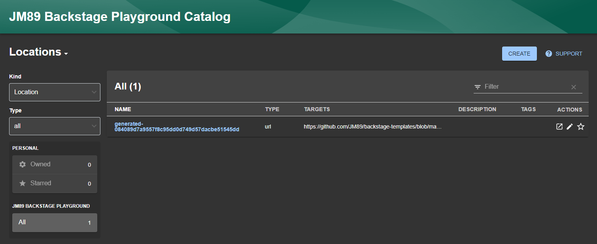

# Backstage App

This is a playground [Backstage](https://backstage.io) implementation to test plugins and integrations.

The pre-requisites are documented [here](https://backstage.io/docs/getting-started/), this is useful to execute all commands described in the instructions below.

## Supported Features

- [x] Backstage application setup (Run as docker container)
- [x] Integration with Postgres DB (local)
- [x] Add a custom software template for Python apps
- [x] Basic Techdocs integration (local)

## Run the application

The application runs as a docker container. It has a number of dependencies, which are made available for local development in a docker-compose too. The environment variables and secrets are stored in the local .env file (ignored by git). In the root folder, rename the .env-example to .env and defines your secrets. This will need to be set only once per development machine.

To run the application: 

```sh
docker compose -f docker-compose.yml -f docker-compose-deps.yml --env-file .env up --build
```

Go to http://localhost:7007/.

## Debug the application

To connect to the docker container with root:

```sh
docker exec -u root -it --workdir / backstage-app bash
```

## Usage

### Register a custom template

I will be using a template I created previously [here](https://github.com/JM89/backstage-templates/tree/main/python-app). More information about creating templates are available in the [official documentation](https://backstage.io/docs/features/software-templates/adding-templates).

Adding create 2 type of entities: Template and Location. 

On the left menu, click <ins>Create +</ins> then <ins>Register existing component</ins>: 


Your template should have a "template.yaml" that 


Clicking on <ins>Analyze</ins> will retrieve the information available in the template.yaml, format them and store in the local browser. The import will actually save the entity as a template in the internal database (`backstage_plugin_catalog`):


Now the template is available in the <ins>Home</ins> page:


### Update a custom template

To update an existing template, select "Locations" in the kind list:



Then select the auto-generated id, and click on <ins>Refresh icon</ins>:


This can take few seconds.

### Create new service using the template

Once you added a template, you can register a component with it:


Click <ins>Choose</ins> and fill up the properties (defined by your template):


Then select the location in the next step: 


A summary will display once you click <ins>Next step</ins>, then start the import: 


A GitHub private repository should appear in the expected location:


Finally, your new component should now appear: 


## Data models

### Database backstage_plugin_catalog

#### Diagram


#### Useful Queries

<details>
    <summary>Entities & Locations</summary> 
    <pre>
SELECT 
    s.entity_id, 
    value as "Kind",
    rs.entity_ref,
    rs.location_key
FROM "search" s
INNER JOIN "refresh_state" rs ON rs.entity_id = s.entity_id
WHERE key='kind'</pre>
</details>

<details>
    <summary>Find all properties per uuid</summary> 
    <pre>
SELECT key, value 
FROM "search"
WHERE entity_id = '40e3e032-2336-4161-bcfb-71da4e059e52'</pre>
</details>

## Useful Links

- [Software Template Examples](https://github.com/backstage/software-templates/tree/main/scaffolder-templates)
- [TechDocs Recommended Setup](https://backstage.io/docs/features/techdocs/architecture#recommended-deployment)